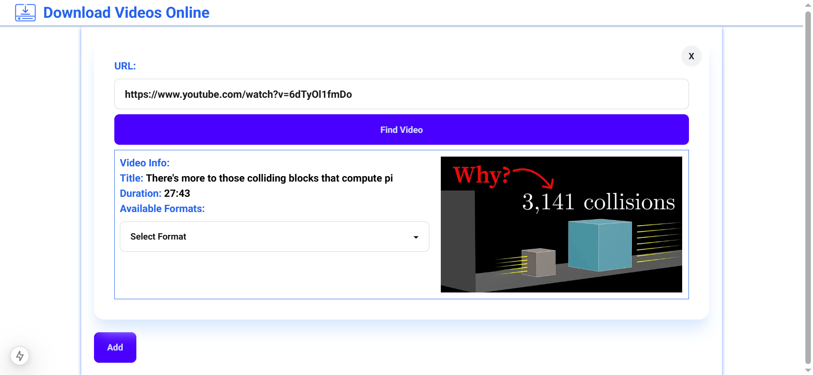
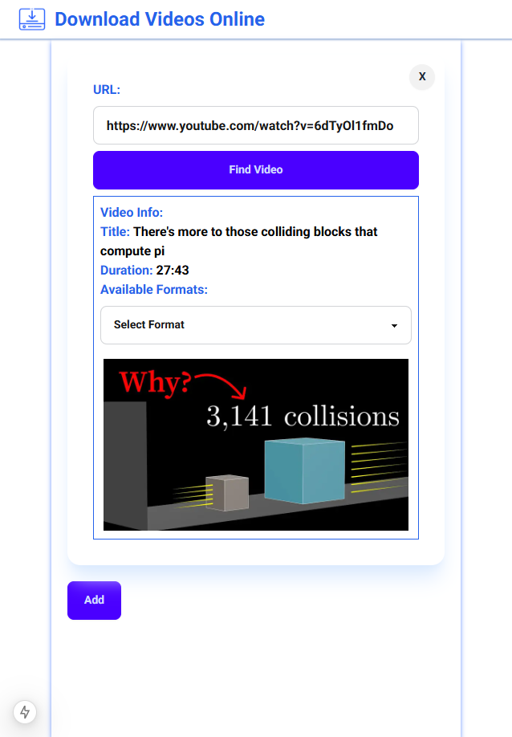

# Online Video Downloader
## About
This web app allows you to download videos from the internet. It is based of **yt-dl** project. The frontend was built using Next.js, and the backend was built utilizing Python (FastAPI), Celery and Redis. 

### Computer Screen

### Mobile Screen



# Features
- The frontend is responsive, making it a great tool to download videos even from mobile phones.
- It is NOT a Command-Line Tool, so its much more intuitive to use.
- It can be hosted and exposed to other users.
- It allows you to download multiple files concurrently. However, you know need to appropriately configure Celery to run multiple parallel workers.
- There is no limit on how many videos you can download or how large the video must be.
- The tool allows you to download various qualities for each video.

## Tested Websites:
- Youtube

## Requirements
- Backend
    - Celery
    - Redis
    - Python
        - FastAPI
        - Dependencies in ***"requirements.txt"***
- Frontend: 
    - Next.js
    - React
    - npm
        - Other dependencies in ***"package.json"***

# Installation Guide:
## Frontend Hosting
- In order to successfully run the tool, you need to host and serve the frontend with npm, passing the appropriate environment variables.
- The required environment variables for the Next.js app are:
```
// Example
NEXT_PUBLIC_API_URL=http://127.0.0.1:8000
NEXT_PUBLIC_API_WEBSOCKET_URL=ws://127.0.0.1:8000
NEXT_PUBLIC_SITE_HOSTNAME=http://127.0.0.1:3000
```
- These variables are checked inside the ***next.config.ts*** file, so you will get a warning if they are not set.

## Backend Hosting
- For the backend, you will need to run Redis, which will be used to schedule tasks and store their results. You can do so by running it in a docker container.
- You will need to install the required depedencies from the ***requirements.txt*** file. Its is best to create a seperate python-virtual-environemnt for this.
- You will also need to run the FastAPI backend. Since yt-dlp is a ***blocking library***, a python backend cannot actually process video-download requests without blocking the ***main thread***. For that, I decided to use Celery as a task queue to process video-download requests. 
- For Celery, you need to run multiple instances of it to process multiple requests in parallel. 
- You need to pass the apporiate environment variables to the python backend:
```
// Example
FRONT_END_ORIGIN=http://127.0.0.1:3000
REDIS_ADDRESS=127.0.0.1
REDIS_PORT=6379
```

# Future Goals
Currently the app is still under development, and I am working on it in my free time. There are still features that I plan to add hopefully in future.

- Docker Deployment, instead of having to install it manually.
- Improve code structure and documentation.
- Cover more edge cases to improve the quality.
- Add cleanup procedure to clear files after download.

# Disclaimer
This project is created solely for educational purposes to explore web technologies and APIs. The author does not endorse or encourage the use of this tool for any activity that violates copyright laws.

By using this project, you agree to take full responsibility for how you use it and ensure compliance with applicable laws and regulations in your jurisdiction. The author assumes no liability for any misuse of this tool.