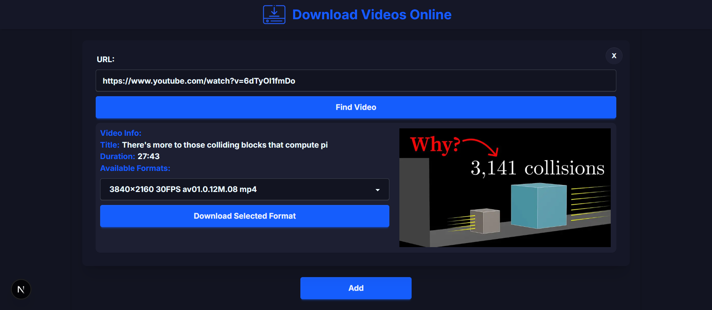
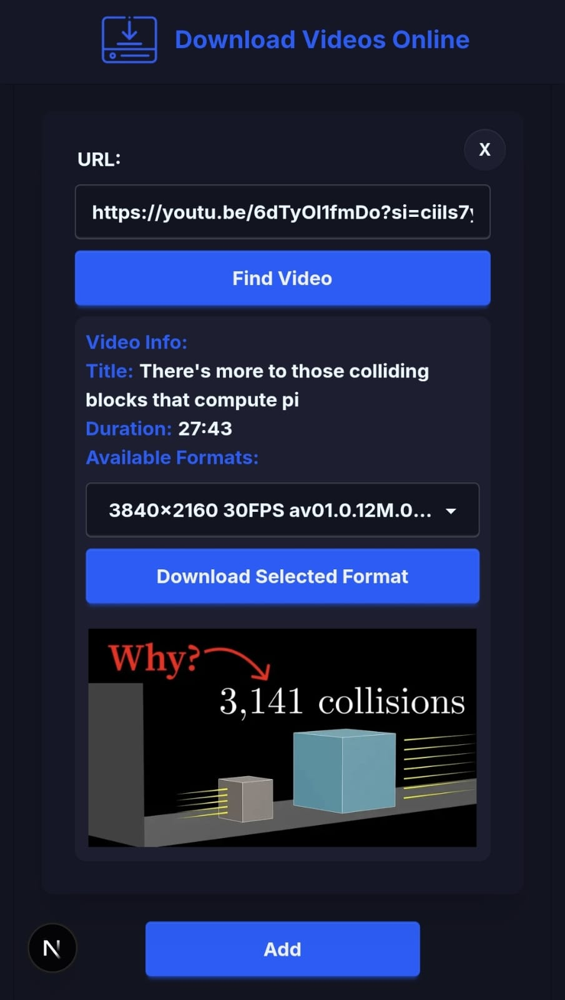
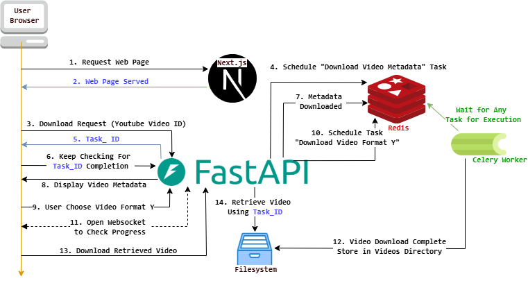

# Online Video Downloader

- [About](#About)
- [Features](#Features)
- [Requirements](#Requirements)
    - [Working Websites](#Working-Websites)
- [Installation Guide](#Installation-Guide)
    - [Full Deployment with Docker](#Full-Deployment-with-Docker)
    - [Frontend Hosting](#Frontend-Hosting)
    - [Backend Hosting](#Backend-Hosting)
- [Technical Breakdown](#Technical-Breakdown)
    - [A Typical Video Download Flow](#A-Typical-Video-Download-Flow)
    - [Architectural choices](#Architectural-choices)
- [Limitations](#Limitations)
    - [Docker Deployment](#Docker-Deployment)
    - [Manual Deployment](#Manual-Deployment)
- [Future Goals](#Future-Goals)
- [Disclaimer](#Disclaimer)

# About
This web app allows you to download videos from the internet. It is based on the **yt-dlp** project. The frontend is built using **Next.js**, and the backend utilizes  **Python (FastAPI), Celery, and Redis**.

### Computer Screen

### Mobile Screen
<p align="center">
    
</p>

# Features
- The frontend is fully responsive, making it easy to download videos from both desktop and mobile devices.
- It's a web-based interface - not a command-line tool - which makes it much more user-friendly.
- The app can be hosted and accessed by multiple users.
- It supports downloading multiple videos at the same time, provided Celery is configured to run multiple workers.
- There are no restrictions on the number or size of videos you can download.
- Users can select from multiple quality options for each video before downloading.


# Requirements
- Backend
    - Python 3
        - [venv](https://docs.python.org/3/library/venv.html)
            -  FastAPI
            -  Celery
            -  Other dependencies in ***"requirements.txt"***
    - Redis
- Frontend: 
    - npm
        - Next.js
        - Other dependencies in ***"package.json"***

## Working Websites
This web app only works with **Youtube**.
# Installation Guide
## Full Deployment with Docker
The easiest way to deploy this app is using docker. The project comes preconfigured with ***Dockerfiles*** and a ***Docker Compose*** file. For this to work, however, you need to have docker installed on your computer, which can be installed easily by following the relevant [guide](https://docs.docker.com/engine/install/).

Having installed docker, you can run the app as follows:
1. Clone the project into a directory and navigate to its root directory.
2. Open the .env file in the root and change the ***REDIS_ADDRESS*** as follows:
```
# Before
REDIS_ADDRESS=localhost 
# After
REDIS_ADDRESS=redis
```
3. At the root directory of the project, run the following command:

```
# This should run all the required services.
docker compose up
```
If this is the first time you run this command, it should take some time to collect, build, and run all the required services.

### Cleanup
If you are done using this app, you can run the following from the root of the project:

```
docker compose down --volumes --rmi all
```
This will stop and remove all the images, containers, and volumes that were built.

## Frontend Hosting
- To run the tool successfully, you need to host and serve the frontend using ***npm***, passing the appropriate environment variables.
- The required environment variables for the Next.js app are:

```
# Example
NEXT_PUBLIC_API_URL=http://127.0.0.1:8000
NEXT_PUBLIC_API_WEBSOCKET_URL=ws://127.0.0.1:8000
```

- These variables are checked inside the ***next.config.ts*** file, so you will see a warning if they are not set or are incorrect.

- One simple way to pass the environment variables is by using an ***.env*** file. You can create an ***.env*** file in the **next-app** folder and update the values accordingly. (This file should already exist after cloning the repository, as it is included by default, i.e., you should find this file under ***next-app/.env***). Next.js will automatically load the .env file and all of the variables in it on startup.

### Running the frontend
1. Clone the project and navigate to the next-app folder, which contains the code for the Next.js app.
2. Then, find the ***.env*** file under next-app folder (i.e., ***next-app/.env***). You must change the environment variables to reflect your network setup.
3. Install the dependencies using:
```
npm install
```
4. You can now choose to run the app either as a development server:
```
npm run dev
```
or as a production server:
```
npm run build
npm run start
```

## Backend Hosting
- For the backend, you'll need to run Redis, which is used to schedule tasks and store their results. You can run Redis in a Docker container (which is what I did during development).
- Install the required dependencies from the **requirements.txt** file. It is recommended to create a separate Python virtual environment for this.
- You'll also need to run the FastAPI backend. Since yt-dlp is a blocking library, the Python backend cannot process video download requests without blocking the main thread.
    - To avoid this, Redis is used as a task queue to store video download requests.
    - Then Celery workers receive those requests and process them on distinct **processes/threads**.
- Set the appropriate environment variables for the backend:
```
# Example
FRONT_END_ORIGIN=http://127.0.0.1:3000,http://localhost:3000
REDIS_ADDRESS=localhost
REDIS_PORT=6379
THUMBNAIL_PATH=thumbnails
VIDEO_PATH=videos
THUMBNAIL_PERSISTANCE_DURATION=300
VIDEO_PERSISTANCE_DURATION=3600
```
- Here again, the environment variables can be simply passed using the **.env** file (There are two different .env files, one for the frontend and one for the backend).
### Running the backend
1. Now to run the backend, ensure you have Redis up and running (Docker or local installation). You must know its address since you must set the environment variables accordingly.
2. Clone the project and navigate to its root directory.
3. Now you need to have **venv** to create a virtual environment. Create a virtual environment and activate it.
4. After that, you can use **pip** to install all the dependencies required to run the backend:
```
pip install -r requirements.txt
```
5. Now ensure that you properly set all the values of the environment variables:
    - **FRONT_END_ORIGIN** -> The full URL address to the frontend, including the protocol, domain name/IP, and port. This is used for Cross-Origin Resource Sharing (CORS). It support multiple origins by seperating  each origin with a comma ***","***.
    - **REDIS_ADDRESS** -> The IP address of Redis.
    - **REDIS_PORT** -> The port number of Redis.
    - **THUMBNAIL_PATH** -> Absolute or relative path from the root of the project, where the thumbnails will be temporarily stored. For example, using "thumbnails" will store thumbnails at **{project root}/thumbnails**.
    - VIDEO_PATH -> Similar to thumbnails, but for temporary video storage.
    - **THUMBNAIL_PERSISTANCE_DURATION** -> How long (in seconds) to keep the thumbnails after download.
    - **VIDEO_PERSISTANCE_DURATION** -> How long (in seconds) to keep the videos after download. This should be a larger value since videos need more time to be downloaded by clients.

***Security Motice:*** Any folder under ***THUMBNAIL_PATH and VIDEO_PATH*** will become publicly readable, so ensure that you do not misconfigure these options as it could lead to exposure of other files. Default values should be good to confine access and avoid exposure of internal files.

***Note:*** All the following commands must be run from a terminal where the newly created virtual environment is active. Also, you must execute the commands from the root directory of the project to account for the relative imports used by Python. For example, your command line prompt should look like this:
```
(video_downloader_python) {path}>
```
This signifies that you are currently using the ***"video_downloader_python"*** environment, and **{path}** is the path to the root of the cloned project.

6. Next, open up a terminal and navigate to the root directory of the project. You will now run the FastAPI backend using the following command:
```
# Ensure you change the host/port to reflect your network structure.  
uvicorn backendcode.API:app --host 0.0.0.0 --port 8000
```

7. Then, open up another terminal, and navigate to the root. You will run a Celery worker with the following command:
```
# This command works on Windows (The solo option to be specific)  
celery -A backendcode.celery_config.celery_app worker --pool=solo --hostname=worker1@%h
```

***Note:*** You can run multiple Celery workers as per your needs. On my Windows machine, I can run multiple workers by opening multiple terminals and running the above command multiple times, while varying the hostname:

```
# On Windows, running multiple workers should be done as follows:  
celery -A backendcode.celery_config.celery_app worker --pool=solo --hostname=worker1@%h
celery -A backendcode.celery_config.celery_app worker --pool=solo --hostname=worker2@%h
celery -A backendcode.celery_config.celery_app worker --pool=solo --hostname=worker3@%h
```
8. If everything goes well, you should be able to navigate the frontend and interact with the app without any issues.

# Technical Breakdown
## A Typical Video Download Flow
<p align="center">
    
</p>

The user first sends a request to the Next.js server to retrieve the frontend of the app **(1)**, and the server responds with the app's frontend **(2)**. The user is presented with a textbox to paste a URL. The user pastes the URL and submits the request to the server **(3)**. 

The FastAPI backend receives the request and schedules a "Download Video Metadata" task **(4)**. The metadata contains information about the available video formats, allowing the user to select one of those formats. Since this task is blocking (i.e., yt-dlp blocks the thread until it makes a request to YouTube’s servers and gets the available formats), Celery can perform the request on a separate thread and post the result asynchronously to Redis. 

While this task is being performed, the FastAPI backend returns a unique **TASK_ID** to the client **(5)**. Now the client can keep checking regularly (every 5 seconds) to see if there is a result **(6)**. Eventually, Celery will have completed fetching the data, and the result will be posted to Redis. The FastAPI backend now can retrieve the metadata from Redis **(7)**, and send it back to the frontend for display **(8)**.

The user can now choose a video format for this video, and submit it to the server **(9)**. This task takes quite some time, so the backend schedules a "Video Download Task" on Redis **(10)**. The client then opens a Websocket channel, which the FastAPI server uses to keep the user updated about the download progress **(11)**. For example, it provides the user with a percentage of how much has been completed of the download progress.

At some point, the Celery worker will have completed the download procedure and the video will be saved in the **"./videos/{task_id}/video.mp4"** directory **(12)**. The FastAPI backend can now serve the video as a static file to the user **(13)**, upon user request **(14)**.

A few  details were not included in this flow, but this shows the most crucial steps involved in the video download procedure.

## Architectural choices

This project uses a modern asynchronous backend architecture powered by FastAPI, Celery, and Redis. Below are the core reasons behind these architectural choices:

### 1. Python’s GIL Limits True Multithreading
Python (specifically CPython) is limited by the Global Interpreter Lock (GIL), which prevents true parallel execution of CPU-bound tasks in a single interpreter session. Since video downloading and processing are often blocking operations, using Python's built-in threading module would not provide actual performance gains, and the backend will hang on each request. Instead, the system delegates these heavy tasks to Celery workers, which are separate processes, achieving true parallelism and efficient resource use.

### 2. Redis + Celery Simplify Task Handling
Manual thread management in Python can become complex and error-prone — especially when dealing with retries, timeouts, task queues, or scaling. Celery abstracts these concerns elegantly:
- Tasks are queued in Redis, acting as a message broker.
- Celery workers consume tasks asynchronously and execute them independently.
- This structure ensures that the FastAPI backend remains responsive and non-blocking.

### 3. Tool Familiarization and Skill Expansion
One key goal of this project was to learn and experiment with production-grade tools like Celery and Redis. These are widely used in the industry and mastering them opens the door to building scalable, distributed systems. Their integration here demonstrates not just functionality but also future readiness for more complex workloads.

### 4. Scalable and Modular Design
Using Redis and Celery enables future scalability — the system can handle more downloads by simply increasing the number of workers without altering the core logic. This makes the tool robust and adaptable to heavier use or multi-user deployments.

# Limitations
## Docker Deployment
- The total size of the app is larger compared to manual deployment. This can be improved by optimizing the Dockerfiles and possibly using multistage builds, which I might address later.
- In the current Docker setup, only a single Celery worker is initialized, meaning only one video can be downloaded at a time. However, you can easily scale this by manually running additional Celery worker instances.
- Currently, the Celery workers and backend must run on the same machine, as they share downloaded files using **Docker volumes**.
## Manual Deployment
- Similar to docker deployment, when deploying the backend manually, you need to have all Celery workers and the FastAPI app on the same machines, as they need to share the ***thumbnails and videos*** folders on the filesystem.


# Future Goals
Currently, the app is in a solid working state, and I continue developing it during my free time. There are still a few features I plan to add in the future:

1. Refactored the codebase and improved documentation. ✅ (Complete)

2. Implemented a cleanup process to automatically remove downloaded files. ✅ (Complete)

3. Manually tested most edge cases to ensure the app handles a variety of scenarios reliably ✅ (Complete).

4. Plan to set up Docker deployment to avoid manual installation steps ✅ (Complete).


# Disclaimer
This project is created solely for educational purposes to explore web technologies and APIs. The author does not endorse or encourage the use of this tool for any activity that violates copyright laws.

By using this project, you agree to take full responsibility for how you use it and ensure compliance with applicable laws and regulations in your jurisdiction. The author assumes no liability for any misuse of this tool.